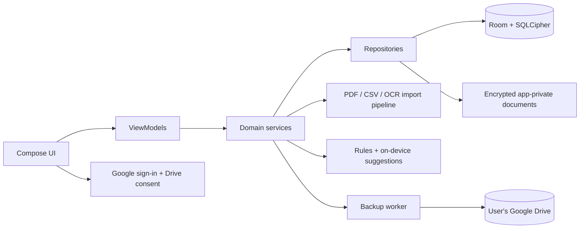

# KoshVista — Technical Requirements Document

**Status:** Implementation specification  
**Product contract:** [PRD](01-product-requirements.md)  
**Data contract:** [Schema](05-backend-schema.md)  
**Navigation contract:** [App flows](03-app-flow.md)

## 1. System boundaries

KoshVista is a native Android application. The **phone is the primary runtime and database host**. Google Identity supplies user identity, and the user's Google Drive stores encrypted backup archives. There is no application-owned backend server in the release architecture. In this document, “backend” means the on-device domain, persistence, import and backup layers plus external Google APIs. This decision satisfies the no-fee constraint and limits exposure of financial data. A future server would require a new security and cost decision, not an implicit migration.

## 2. Client stack and project structure

| Layer | Technology | Decision reason |
|---|---|---|
| Language/build | Kotlin, Android Gradle Plugin, Gradle Kotlin DSL, Android Studio | Supported native APK workflow. |
| UI | Jetpack Compose, Material 3, Navigation Compose | Declarative, accessible and adaptable to chart-heavy screens. |
| State | ViewModel, StateFlow, Coroutines | One-way data flow and cancellable import/backup work. |
| Dependency injection | Hilt | Clear construction of repositories, workers and parsers. |
| Database | Room + SQLCipher for Android | Typed SQL and encrypted local storage; exact version pair must pass integration tests before lockfile freeze. |
| Preferences | DataStore | Small non-financial preferences; all financial data remains in the database. |
| Charts | Vico for time-series/bars; Compose Canvas for specialised visuals | Open-source chart base with custom dashboard styling. |
| Files | Android Storage Access Framework and Photo Picker | Narrow, user-selected access to PDFs, CSVs and screenshots. |
| Background work | WorkManager | Durable queued backup and import tasks, subject to Android scheduling. |
| Logging | Local structured diagnostics with redaction | Debugging without leaking amounts, account numbers or document contents. |

Use feature packages or modules for `identity`, `ledger`, `imports`, `investments`, `fixedincome`, `analytics`, `backup`, and `settings`, with shared `core/model`, `core/database`, `core/security`, and `core/ui`. Avoid a generic service layer that bypasses the repositories or allows screen code to write SQL directly.

**Platform baseline:** Android API 26 minimum, Android 14 as the first test target. Target and compile SDKs must use current supported versions at build time; dependency versions are pinned only after a reproducible build and licence review.

## 3. Domain and local backend

The database is partitioned by immutable Google account subject ID (`owner_id`), never by mutable email address. A local owner has accounts, transactions, source documents and derived assets. All repository reads/writes require `owner_id`; account switch locks the database context, clears in-memory sensitive state, and opens only the selected owner's vault.

Money is stored as **signed integer minor units** plus ISO 4217 currency. Quantities and prices use canonical decimal strings with bounded precision; floating point is forbidden for ledger maths. All stored timestamps use UTC epoch milliseconds; a transaction also retains the source's local date and zone/locale interpretation. Analytics convert to the selected base currency only with a stored dated exchange rate; missing rates show “unvalued,” never zero.

Ledger rules:

- Expense amount is negative on its source account; income is positive.
- A transfer creates two linked entries of equal magnitude and currency (or an explicit FX conversion), excluded from income/expense totals.
- A refund links to the original expense when known and reverses its category effect.
- Split allocation amounts sum exactly to the parent transaction amount.
- An account's displayed balance equals its opening balance plus posted ledger entries through the selected date; statement balances are reconciliation evidence, not silent overrides.
- Investment trades link to a funding/cash entry when available. Positions derived from complete trade history are labelled “ledger-derived”; imported holdings are dated snapshots. They must not be merged into a fabricated history.
- FD/bond projections are separate from posted cash flows; projected interest cannot enter actual income until posted or confirmed.

Detailed tables, keys and indexes are defined in [05-backend-schema.md](05-backend-schema.md).

## 4. Document import and on-device intelligence

### Pipeline

1. User selects a file with a system picker. Copy to an encrypted app-private staging location; record MIME, size and SHA-256. Reject oversize/unsupported/corrupt input with a recoverable error.
2. Detect document family and likely institution from local, non-sensitive signatures. Let the user override detection.
3. For text PDFs, use PdfBox-Android; for image PDFs, render pages and run bundled ML Kit OCR; for screenshots, run OCR directly; for CSV, parse with a strict dialect detector.
4. An adapter maps text blocks/rows into **candidates**: transactions, position snapshots, trade rows or fixed-income terms. Preserve page, bounding box/row and raw excerpt references.
5. Validate dates, amounts, debit/credit direction, currency, duplicates, account identity and totals. Create confidence/review tasks.
6. Show a review summary and uncertain items. Commit accepted records atomically; mark the import complete. Reimport uses file hash and per-record fingerprints plus overlap checks.
7. Update chart queries and enqueue backup. A failed import never leaves half a statement posted.

Parser adapters are versioned and tested using redacted fixtures. A bank or broker is “supported” only for tested file families, not merely because its logo is listed. AI may suggest a category, merchant or interpretation; validators and user review decide posted records. Bank passwords, PINs and OTPs are never collected. A PDF password is held only for the current open operation.

### Intelligence strategy

First use deterministic patterns, lookup tables and learned correction rules stored on device. ML Kit provides OCR at no API cost. Optional local classification models may improve suggestions after measurement; on-device generative APIs are **capability-gated**, never required for core parsing or available on an assumed phone. Every insight cites record IDs and can be dismissed. No cloud LLM receives financial documents by default.

## 5. Authentication, authorisation and sessions

1. Google Sign-In via Android Credential Manager identifies the user. Use Google `sub`/stable account identifier, not email, as `owner_id`.
2. Separately request Drive `drive.file` OAuth scope for app-created backup files. Denial leaves the local app usable but marks cloud protection incomplete.
3. Local biometric/device credential protects re-entry; it is **a local lock**, not a substitute for Google identity or the backup recovery secret.
4. Tokens remain in platform-managed credential storage where possible and never in logs, exports or the backup archive. Revoke/switch account clears cached authorisation and locks the vault.
5. The app may show the last locally authenticated owner's offline data after local unlock. A new owner requires a successful online Google identity check before a vault is created/restored.
6. Public OAuth consent, package-signing fingerprint and any Google verification must be completed before public distribution.

There are no app-owned HTTP login endpoints, password table or server sessions in this architecture. Device-side `local_session` metadata tracks active owner, lock timeout and last verification; see schema.

## 6. Backup, restore and Drive API contract

**Backup contents:** a consistent database snapshot, encrypted source documents and attachments, user settings, schema version, archive manifest and integrity hashes. The archive is encrypted before any network transfer. Keep at least one prior known-good version, subject to an explicit bounded retention policy and available storage; never delete the only verified backup.

**Key design:** generate a random data-encryption key (DEK). Wrap one copy with a device-keystore key for convenient local use. Wrap a second copy with a key derived from a user-held recovery passphrase using a salted, calibrated password KDF. Use authenticated encryption (AES-256-GCM) with unique nonces and format/version metadata. Restore needs the recovery passphrase; no developer-controlled recovery backdoor. Never upload plaintext secrets or keep a passphrase in persistent storage.

**Drive operations:** create an app-owned folder with `drive.file`; create/list/download/update only app-owned encrypted archives and manifest files; use resumable upload for large files. Queue work after local commits and on reconnect; use WorkManager network constraints, backoff and a periodic safety sweep. Show `pending`, `uploading`, `verified`, `failed`, `quota_exceeded`, `permission_revoked`, or `recovery_key_missing` status. Verify server metadata and a download/decrypt/integrity check before marking a new version known-good. Restore lists versions, validates format/hash, decrypts into a staging vault, migrates schema, then atomically swaps to the restored vault. Existing local data requires an explicit replace/merge choice; merge is unavailable until conflict logic is implemented.

**Important limit:** Android does not guarantee an exact upload instant while the app is backgrounded. This is durable, automatic eventual backup, not continuous server mirroring. One user's Drive backup does not grant another user access. Live multi-device writes are outside version-one scope.

## 7. APIs and integrations

| Interface | Purpose | Data/permission boundary |
|---|---|---|
| Google Identity APIs | Sign-in identity | Basic identity only. |
| Google Drive API v3 | User-owned encrypted backup files | `drive.file`; no full-Drive scope. |
| Android document/photo pickers | Import selected user files | URI grant for the selected file only. |
| Android BiometricPrompt/Keystore | Unlock and local key wrapping | No external server. |
| Android notifications | Optional later, opt-in bank-alert signal | Never the authoritative ledger; must pass privacy/reliability review. |

There are **no custom REST/GraphQL endpoints** in the release. The app defines internal interfaces (`AuthGateway`, `BackupStore`, `DocumentExtractor`, `ImportAdapter`, `ValuationSource`) so integrations can change without rewriting the ledger. No broker scraping or paid market-data API is permitted. Prices shown from uploaded statements/snapshots must show their `as_of` time and source.

## 8. Security, privacy and ownership

- Encrypt the local SQL database and copied documents. Exclude plaintext staging, tokens and keys from Android/system backups; delete temporary OCR bitmaps and decrypted staging files promptly.
- Use TLS for Google APIs; do not weaken certificate checks. Validate MIME *and* content, cap file/page sizes, and treat PDFs as untrusted input.
- Never log raw transaction narratives, account numbers, personal identifiers, OAuth tokens, OCR output or passphrases. Crash reports, if introduced, require opt-in and redaction.
- Keep source documents separate from public media folders. Use screen capture protection for sensitive views if usability testing supports it.
- Each query and write carries the active owner ID. Restore rejects a backup whose owner identity does not match the signed-in account, even if a file is manually placed in its folder.
- Sign release APKs with Ritik-owned signing material. Keep the keystore outside the repository and protect an offline copy; never commit credentials or sample financial statements.
- Make deletion explicit: local data, Drive backups, and Google OAuth access are separate operations with separate results.
- Document third-party licenses and verify actual SDK terms before release. No hidden charges or billing-enabled service may be added by transitive setup.

## 9. Performance, reliability and observability

- Dashboard opens from the local database without a network call. Heavy OCR/import runs off the main thread and reports cancellable progress.
- Use pagination for transaction history, indexed date/account queries, and cached aggregate tables only if profiling shows a need.
- Large backup archives use resumable uploads. Low storage, no network, permission revocation and quota errors preserve the local ledger and expose actionable status.
- Maintain local, redacted diagnostics for import adapter name/version, failure code, elapsed time, counts and backup state. Export diagnostics only after the user chooses to share them.
- Accessibility tests cover TalkBack, large text, chart summaries and error recovery. Security tests cover owner isolation, backup tampering, wrong passphrase and session switch.

## 10. Deployment and key decisions

1. Build reproducible debug and release APKs locally or in a private CI with strict secret handling. The first signed APK is installed on the owner's Realme GT2 and tested with redacted documents.
2. Maintain source in a **public, open-source GitHub repository** under Ritik's identity, with an explicit open-source licence (Apache-2.0 recommended). GitHub Actions may run non-secret tests within free usage limits; signing should remain local until secure secret handling is justified. Public CI logs, fixtures and artefacts must contain no personal financial data or credentials.
3. Distribute signed APKs directly for personal use. For later limited sharing, evaluate Android's current free limited-distribution path; public Play release is not assumed free.
4. No Vercel, Firebase, Supabase, hosted database, paid AI API or custom server is required for the agreed release architecture.

| Decision | Reason | Revisit when |
|---|---|---|
| Offline-first Android | Native APK, low latency and privacy | Cross-platform support becomes a requirement. |
| Per-user Drive backup | Cloud recovery without a funded backend | True multi-device sync or collaboration is required. |
| Local extraction + validation | Cost control and auditable finance | Device evidence proves a specific model improves quality. |
| Snapshot-aware investments | Screenshots omit trade history | Reliable authorised broker exports/APIs are available. |
| No live market feed | Licensing and zero-fee constraint | A permitted, stable source is verified. |

## 11. Reference documentation

- [Android architecture recommendations](https://developer.android.com/topic/architecture/recommendations)
- [Room persistence](https://developer.android.com/jetpack/androidx/releases/room)
- [SQLCipher Android/Room integration](https://github.com/sqlcipher/sqlcipher-android)
- [Google Drive API scopes](https://developers.google.com/workspace/drive/api/guides/api-specific-auth)
- [Google Drive resumable uploads](https://developers.google.com/workspace/drive/api/guides/manage-uploads)
- [Android persistent work](https://developer.android.com/develop/background-work/background-tasks/persistent)
